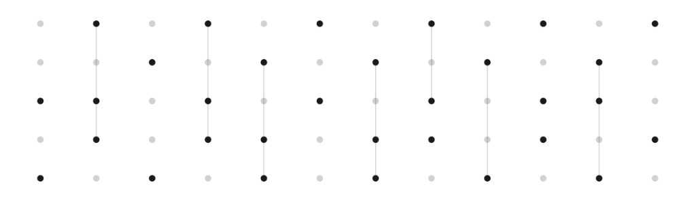

# Transformer VM

[](https://github.com/Percepta-Core/transformer-vm/actions/workflows/ci.yml)



A standard softmax-ReGLU transformer whose weights are computed
**analytically** that correctly simulates a WebAssembly
virtual machine on arbitrary programs.

**Blog posts:** [Can LLMs Be Computers?](https://www.percepta.ai/blog/can-llms-be-computers) | [Constructing the LLM Computer](https://www.percepta.ai/blog/constructing-llm-computer) *(coming soon)*

## Prerequisites

- **Python 3.11+**
- **[uv](https://docs.astral.sh/uv/)** package manager
- **LLVM/Clang with wasm32 target** -- needed to compile C examples to WebAssembly

  | OS | Install |
  |----|---------|
  | macOS | `brew install llvm lld` (Xcode clang lacks wasm32; LLD is a separate formula) |
  | Ubuntu/Debian | `sudo apt install clang lld` (16+) |

  You can verify with `clang --print-targets | grep wasm32`.
  Alternatively, set `CLANG_PATH` to point to a specific clang binary.

- **C++17 compiler** -- used to build the C++ inference engine (`clang++` on macOS, `g++` on Linux)

## Quick Start

### Install dependencies

```bash
uv sync
```

### Run everything (one command)

```bash
uv run wasm-run
```
This automatically:
1. Compiles all C examples from `examples/manifest.yaml` to WASM token files
2. Solves the MILP schedule and constructs transformer weights
3. Builds the C++ inference engine
4. Runs all programs (~30K tok/s)

### Compile and run a specific program

```bash
# Compile a C program to WASM tokens
uv run wasm-compile transformer_vm/examples/collatz.c --args 7

# Run it through the transformer
uv run wasm-run transformer_vm/data/collatz.txt
```

### Compile all examples from the manifest

```bash
uv run wasm-compile --all
```

### Run with the graph evaluator

The graph evaluator runs the computation graph directly with exact
arithmetic -- no transformer weights needed. Useful as a correctness
reference.

```bash
# Run all programs (hull attention by default)
uv run wasm-eval

# Disable hull attention (brute-force, slower)
uv run wasm-eval --nohull

# Regenerate reference files
uv run wasm-eval --regen
```

### Force Python inference

```bash
uv run wasm-run --python
```

### Specialize for a single program (Futamura projection)

```bash
# Bake collatz into the weights
uv run wasm-specialize transformer_vm/data/collatz.txt --save-weights=collatz.bin

# Run with the specialized model
uv run wasm-run --model collatz.bin transformer_vm/data/collatz_spec.txt
```

## CLI Commands

| Command | Description |
|---------|-------------|
| `wasm-run` | Run programs through the transformer (C++ engine, auto-builds everything) |
| `wasm-eval` | Run programs through the graph evaluator (exact arithmetic, no weights) |
| `wasm-compile` | Compile C/WASM to token files (`--all` for manifest) |
| `wasm-build` | Build universal transformer weights explicitly |
| `wasm-specialize` | Bake a program into transformer weights (Futamura projection) |
| `wasm-reference` | Generate reference token traces by executing WASM directly |

## Key Concepts

### Computation Graph

The core abstraction (`transformer_vm/graph/core.py`) defines five primitive
types that compose into a DAG:

- **InputDimension** -- token embedding values (set per-token)
- **ReGLUDimension** -- `ReLU(b) * a`, the gated FFN unit
- **PersistDimension** -- materializes an expression into a residual slot
- **LookUpDimension** -- attention-based retrieval from token history
- **CumSumDimension** -- cumulative sum via attention averaging

From these primitives, two helper functions build all conditional logic:

- `reglu(a, b)` = `ReLU(b) * a` (one FFN neuron)
- `stepglu(a, b)` = `a * step(b >= 0)` (two FFN neurons + persist)

### WASM Machine

`transformer_vm/wasm/interpreter.py` encodes 35 WebAssembly opcodes entirely
through the computation graph using byte-level arithmetic with carry
propagation. The machine state (stack, memory, locals, cursor, call depth) is
tracked via attention lookups and cumulative sums.

### Two Execution Modes

**Universal interpreter** -- the program bytecode is part of the input
token sequence. Instruction-fetch attention heads look up opcodes from
the program prefix. Any WASM program can be run without rebuilding the model.

**First Futamura projection** (`transformer_vm/specialize.py`) -- the program
is baked into the FFN weights. The program prefix is eliminated from the
input, yielding a model specialized to one program.

### O(log n) Hull KV Cache

Standard softmax attention is O(n) per step. Since this model uses
hardmax attention (softmax with a very large temperature scaling,
effectively argmax), the winning key for each query is a vertex of the
2D convex hull of all keys. The `transformer_vm/attention/` module maintains
an incremental convex hull per attention head, giving O(log n) insert and
query -- critical for programs that generate millions of tokens.

### C++ Inference Engine

`transformer_vm/model/transformer.cpp` is a standalone C++ implementation
that loads the model weights from a binary file and runs autoregressive
generation. It uses the same CHT hull cache for O(log n) attention, BLAS
for matrix-vector products (Accelerate on macOS), and sparse head
projection. Built automatically by `wasm-run` on first use.

## File Guide

```mermaid
graph TD
  root["transformer_vm/"]

  subgraph graphMod ["graph/"]
    corePy["core.py — Core DSL: Expression, Dimension, ReGLU, LookUp, Persist, ProgramGraph"]
  end

  subgraph wasmMod ["wasm/"]
    interpreterPy["interpreter.py — 35-opcode WASM machine with Futamura specialization"]
    referencePy["reference.py — Reference trace generator for correctness testing"]
  end

  subgraph modelMod ["model/"]
    transformerPy["transformer.py — PyTorch VanillaTransformer with ReGLU FFN"]
    transformerCpp["transformer.cpp — Standalone C++ inference engine with hull attention"]
    weightsPy["weights.py — Analytical weight construction: graph + schedule to tensors"]
  end

  subgraph schedulerMod ["scheduler/"]
    milpPy["milp.py — MILP solver for optimal gate-to-layer assignment"]
  end

  subgraph attentionMod ["attention/"]
    hull2dCht["hull2d_cht.h — CHT-based 2D convex hull: O(log n) insert and query"]
    hullExt["hull_ext.cpp — pybind11 bindings for HullKVCache"]
    hullCache["hull_cache.py — Python wrapper for O(log n) hull KV cache"]
    standardCache["standard_cache.py — Reference O(n) softmax KV cache"]
    cmakeLists["CMakeLists.txt — Build config for hull_ext extension"]
  end

  subgraph compilationMod ["compilation/"]
    compileWasm["compile_wasm.py — C/WASM to token prefix pipeline"]
    decoderPy["decoder.py — WASM MVP binary decoder"]
    lowerPy["lower.py — Lower unsupported ops: MUL, DIV, AND, OR, XOR, SHL, SHR"]
    runtimeH["runtime.h — C runtime for WASM programs, auto-injected by compiler"]
  end

  subgraph cliMod ["CLI entry points"]
    runnerPy["runner.py — wasm-run: transformer inference via C++ or Python"]
    evaluatorPy["evaluator.py — wasm-eval: graph evaluator with exact arithmetic"]
    buildPy["build.py — wasm-build: construct universal transformer weights"]
    specializePy["specialize.py — wasm-specialize: First Futamura projection"]
    pathsPy["_paths.py — Canonical resource paths"]
  end

  subgraph examplesMod ["examples/"]
    manifest["manifest.yaml — Program names and default args"]
    helloC["hello.c — Hello world using printf"]
    additionC["addition.c — Long addition with carry propagation"]
    collatzC["collatz.c — Collatz sequence using ADD/SUB only"]
    fibonacciC["fibonacci.c — Fibonacci using sscanf/printf"]
    minCostC["min_cost_matching.c — Hungarian algorithm for min-cost bipartite matching"]
    sudokuC["sudoku.c — Constraint-propagation Sudoku solver"]
  end

  subgraph dataMod ["data/ — auto-generated, gitignored"]
    dataTxt["*.txt — Compiled WASM programs"]
    dataSpec["*_spec.txt — Specialized model inputs"]
    dataRef["*_ref.txt — Reference output for verification"]
  end

  subgraph testsMod ["tests/"]
    testSmoke["test_smoke.py — End-to-end smoke tests"]
    testDistill["test_distill.py — Model build + inference tests"]
    testSpecialize["test_specialize.py — First Futamura projection tests"]
    subgraph fixturesMod ["fixtures/"]
      loweringTest["lowering_test.c — Lowering pass stress test"]
    end
  end

  root --> graphMod
  root --> wasmMod
  root --> modelMod
  root --> schedulerMod
  root --> attentionMod
  root --> compilationMod
  root --> cliMod
  root --> examplesMod
  root --> dataMod
  root --> testsMod
```



## Development

### Install dev dependencies

```bash
uv sync --extra dev
```

### Run tests

```bash
# Fast tests only
uv run pytest -m "not slow"

# All tests (including model build/inference)
uv run pytest
```

### Lint

```bash
uv run ruff check .
```

## Supported WASM Opcodes

HALT, RETURN, CALL, BR, BR_IF, DROP, SELECT,
LOCAL_GET, LOCAL_SET, LOCAL_TEE, GLOBAL_GET, GLOBAL_SET,
LOAD, LOAD8_S, LOAD8_U, LOAD16_S, LOAD16_U,
STORE, STORE8, STORE16, CONST,
EQZ, EQ, NE, LT_S, LT_U, GT_S, GT_U,
LE_S, LE_U, GE_S, GE_U,
ADD, SUB, OUTPUT.

Unsupported (lowered at compile time): MUL, DIV, MOD, AND, OR, XOR, SHL, SHR.
These are expanded into sequences of supported ops by `transformer_vm/compilation/lower.py`.
The lowerer handles both constant and variable operands.

## Example: Sudoku

The `transformer_vm/examples/sudoku.c` file implements a Norvig-style constraint-propagation
solver with backtracking search. When compiled to WASM and run through the
transformer:

1. `wasm-compile` compiles C to WASM, lowers hard ops, emits token prefix
2. The transformer executes the WASM bytecode autoregressively
3. Each token represents one byte of machine state (stack values, memory, output)
4. The solver prints chain-of-thought reasoning as it propagates constraints and searches

```bash
uv run wasm-run transformer_vm/data/sudoku.txt
```

The Sudoku solver demonstrates the system's ability to handle complex,
real-world algorithms with deep call stacks, extensive memory operations,
and long execution traces (~900K tokens, solved at ~30K tok/s).

